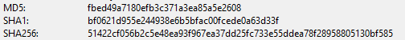

# Forensischer Untersuchungsbericht – USB-Stick-Analyse

## 1. Allgemeine Informationen

**Untersuchungsgegenstand:**  
USB-Stick (FAT16), Kapazität: 1,99 GB

**Datum der Sicherstellung:**  
06.05.2025

**Datum der Analyse:**  
07.05.2025

**Analystin:**  
[R. Metz]

**Verwendete Tools:**  
- Autopsy (Version 4.22.1)
- FTK Imager (Version 4.7.3.81, zur Image-Erstellung)
- Windows 10 (Analyse-Umgebung)
- Hash-Funktion: MD5 / SHA1

---

## 2. Fallbeschreibung

Am 06.05.2025 wurde ein USB-Stick aufgefunden, dessen Inhalt Hinweise auf die Speicherung vertraulicher oder unerlaubter Dateien gibt. Mehrere Dateien scheinen gelöscht oder umbenannt worden zu sein. Ziel der Analyse ist die Wiederherstellung dieser Daten sowie die Nachvollziehbarkeit der Nutzung durch Zeitstempel und Artefakte.

---

## 3. Vorgehensweise

### 3.1 Imaging

- Der USB-Stick wurde mit **FTK Imager** im RAW-Format (`.dd`) gesichert.
- Es wurden **keine Veränderungen** am Originalmedium vorgenommen (Read-Only-Zugriff).
- Die Integrität wurde durch folgende Hashwerte dokumentiert:

### 3.2 Import & Analyse

- Das Image wurde in Autopsy importiert.
- Folgende Module wurden aktiviert:
  - Datei-Analyse
  - Gelöschte Dateien
  - Zeitachsen-Darstellung (MACB)
  - Hash-Sets (Default)

---

## 4. Ergebnisse

### 4.1 Verzeichnisse & Dateien

Es wurden folgende Dateien gefunden:

[Dateiübersicht als CSV anzeigen](../dokumentation/usb_image.001.csv)

## Übersicht: Auffällige Dateien auf dem USB-Stick

| Ordner         | Dateiname                | Status     | Typ           | Auffälligkeit / Kommentar                           |
|----------------|--------------------------|------------|----------------|-----------------------------------------------------|
| /Zugänge       | vpn_zugangsdaten.txt     | gelöscht   | Textdatei      | Zugangsdaten zu einem VPN-Server, Inhalt rekonstruierbar |
| /Zugänge       | admin_passwoerter.xlsx   | vorhanden  | Excel-Datei    | Plausible Liste mit Admin-Zugangsdaten              |
| /Privat        | nudes.jpg                | gelöscht   | Bild           | Provokanter Dateiname, Inhalt unbedenklich          |
| /Downloads     | spotify_crack.zip        | vorhanden  | ZIP-Archiv     | Verdacht auf illegale Software, enthält leere Datei |
| /Tools         | putty.exe                | vorhanden  | .exe-Datei     | Typische Remote-Access-Software                     |
| /Gelöscht      | gehaltsliste_2022.xlsx   | gelöscht   | Excel-Datei    | Interne Gehaltsdaten, rekonstruierbar               |
| /Gelöscht      | kündigung.docx           | gelöscht   | Word-Dokument  | Enthält Kündigungsschreiben                         |
| /Privat        | urlaub2023.jpg           | vorhanden  | Bild           | Privatbild, unauffällig                             |

### 4.2 Zeitstempelanalyse (MACB)

Auffällige Manipulation bei mehreren Dateien, z. B.:
- Zugriffszeit **nach** Löschzeit
- „Created“-Zeit ≠ „Modified“-Zeit

### 4.3 Artefakte

- Temporärdateien (`.tmp`) im Root-Verzeichnis
- Verdächtige Ordnerstruktur: `/Zugänge`, `/Privat`, `/Gelöscht`
- Recycle Bin-Überreste identifizierbar

---

## 5. Bewertung & Schlussfolgerung

Die forensische Analyse hat gezeigt, dass der USB-Stick **gezielt genutzt wurde**, um sensible oder auffällig benannte Dateien zu speichern und anschließend teilweise zu löschen. Die wiederhergestellten Daten lassen auf eine **intentionale Nutzung im Kontext dienstlicher Informationen** schließen.

---

## 6. Screenshots & Belege

Siehe Ordner `/screenshots/` im Repository.

---

## 7. Hinweise & Limitierungen

- Das Image wurde auf einem Testsystem ohne Write-Blocker erstellt (kein Produktiveinsatz)
- Alle verwendeten Inhalte wurden ausschließlich zu Ausbildungszwecken erzeugt
- Eine weitergehende Hash-Analyse mit bekannten Malware-Signaturen wurde nicht durchgeführt

---

## 8. Anhang (optional)

- Image-Metadaten
- Zeitachsenübersicht
- Dateiübersicht (CSV)

---

*Ende des Berichts – Erstellt am [TT.MM.JJJJ]*

